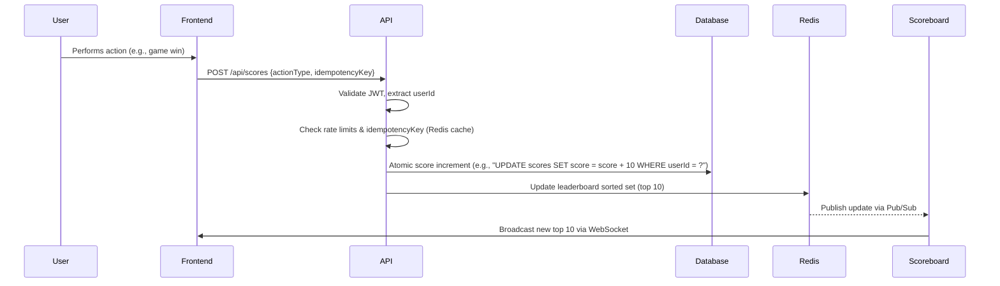

# Live Scoreboard API Module

## Overview
This module handles real-time score updates for a live scoreboard, ensuring secure and efficient synchronization of top 10 user scores. It includes authentication, validation, and mechanisms to prevent unauthorized score manipulation.

## Module Design

### Functional Requirements
1. **Score Update Endpoint**  
   - Accepts user actions, validates authorization, and increments scores.  
   - **Endpoint:** `POST /api/scores`  
     **Request Body:**  
     ```json
     {
       "actionType": "completed_action",  // e.g., "quiz_complete"
       "idempotencyKey": "uuid_v4"        // Unique request identifier
     }
     ```
     **Response:**  
     ```json
     {
       "status": "success",
       "newScore": 150
     }
     ```

2. **Live Scoreboard**  
   - Maintains and broadcasts the top 10 scores in real-time using WebSockets/SSE.  
   - **Endpoint:** `GET /api/scores/top`  
     **Response:**  
     ```json
     {
       "scores": [
         {"userId": "user123", "score": 300},
         {"userId": "user456", "score": 250}
       ]
     }
     ```

3. **Security**  
   - Authentication via JWT (user ID extracted from token).  
   - Rate limiting (100 requests/minute/user).  
   - Atomic database updates to prevent race conditions.

---

## Execution Flow



## Implementation Details

### Database Schema
```sql
CREATE TABLE scores (
  userId VARCHAR(36) PRIMARY KEY,
  score INT NOT NULL DEFAULT 0,
  lastUpdated TIMESTAMP
);
```

### Dependencies
- Authentication: JWT library (e.g., jsonwebtoken).
- Real-Time Updates: WebSocket library (e.g., Socket.io) or Redis Pub/Sub.
- Caching: Redis for leaderboard and idempotency keys.

### Error Handling
| HTTP Code | Error Code          | Description                     |
|-----------|---------------------|---------------------------------|
| 401       | `INVALID_TOKEN`     | Invalid/missing JWT            |
| 429       | `RATE_LIMITED`      | Too many requests              |
| 400       | `INVALID_ACTION`    | Unrecognized `actionType`      |
| 409       | `CONFLICT`          | Duplicate idempotencyKey       |


## Improvement Suggestions

### High Priority

1. Idempotency Key Expiry

- Store keys in Redis with a 24-hour TTL to prevent indefinite growth.

2. Score Calculation Rules

- Move action-to-point mappings (e.g., quiz_complete = 10 points) to a config file/database.

3. Database Indexing

- Add an index on score for efficient top 10 queries.

### Medium Priority

4. Input Validation

- Reject invalid actionType values (e.g., unsupported actions).

5. Monitoring

- Log metrics (latency, error rates) and set up alerts for anomalies.

### Future Considerations

6. Fraud Detection

- Flag suspicious spikes (e.g., +1000 points in 1 minute) for review.

7. Historical Data

- Add a scores_audit table to track changes for accountability.


## Notes for Engineers
- Atomicity: Use database transactions for score updates to avoid race conditions.

- Scalability: Design the API to be stateless; use connection pooling for Redis/DB.

- Testing: Include unit tests for JWT validation, idempotency, and concurrency edge cases.